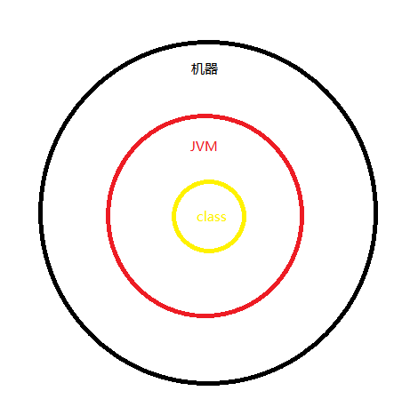

* 1.什么是 JVM？什么是 JDK？ 什么是 JRE？
  

1.什么是 JVM？什么是 JDK？ 什么是 JRE？
____
* JVM 是 Java Virtual Machine（Java 虚拟机）的缩写，是整个java实现跨平台的最核心的部分，所有的 java 程序会首先被编译为.class 的类文件。class类文件可以直接在虚拟机上运行，也就是说class不直接与机器的操作系统相对应，而是经过虚拟机间接的与机器进行交互。

* JDK是java development kit（java 开发工具包）的缩写。它拥有 JRE 所拥有的一切，还有编译器（javac）和工具（如 javadoc 和 jdb）。它能够创建和编译程序。
* JRE是java运行时环境。它是运行已编译 Java 程序所需的所有内容的集合，包括 Java 虚拟机（JVM），Java 类库，java 命令和其他的一些基础构件。但是，它不能用于创建新程序。

如果只是为了运行java程序，那么只需要安装JRE即可。